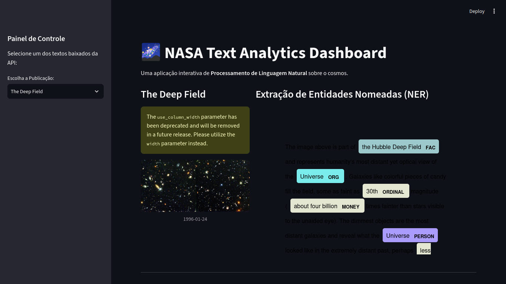

# 🌌 NASA Text Analytics: NLP & Topic Modeling Dashboard



[](https://www.python.org/)
[](https://streamlit.io/)
[](https://spacy.io/)

## 📖 Visão Geral do Projeto
Este projeto é uma aplicação web interativa *end-to-end* focada em **Processamento de Linguagem Natural (NLP)**. O objetivo é analisar semanticamente as publicações diárias do *Astronomy Picture of the Day* (APOD) da NASA, extraindo informações ocultas, mapeando entidades e descobrindo padrões temáticos em textos não estruturados usando técnicas de Machine Learning não supervisionado.

## 🧠 Arquitetura e Pipeline de Dados

O projeto foi estruturado em um pipeline de 4 etapas principais:

### 1. Ingestão de Dados (API Consumption)
* Conexão com a **NASA Open API** (endpoint `planetary/apod`).
* Extração automatizada de histórico de publicações (imagens e textos explicativos) e estruturação do retorno JSON em DataFrames do Pandas para manipulação analítica.

### 2. Pré-processamento de Texto (Text Cleaning & Lemmatization)
* Utilização da biblioteca **spaCy** (`en_core_web_sm`) para padronização do *corpus*.
* Construção de um pipeline de limpeza que inclui: conversão para *lowercase*, remoção de *stopwords*, pontuações e numerais.
* **Lematização:** Redução das palavras ao seu radical base (ex: *galaxies* → *galaxy*) para garantir consistência na modelagem matemática.

### 3. Aprendizado Não Supervisionado (Topic Modeling)
* **Vetorização TF-IDF:** Transformação do texto limpo em uma matriz matemática, calculando a relevância de cada termo em relação ao corpus global (Term Frequency - Inverse Document Frequency).
* **Fatoração de Matrizes (NMF):** Aplicação do algoritmo *Non-Negative Matrix Factorization* para clusterização semântica, permitindo que a Inteligência Artificial descubra automaticamente os 5 principais eixos temáticos das publicações da NASA sem a necessidade de *labels* prévios.

### 4. Extração de Informação e Front-End (NER & UI)
* Aplicação de **Named Entity Recognition (NER)** para varrer os textos e classificar substantivos próprios em categorias como Organizações (`ORG`) e Locais Cósmicos/Terrestres (`LOC`, `GPE`).
* Desenvolvimento de uma interface de usuário interativa com **Streamlit**, permitindo que o usuário final navegue pelo *corpus*, visualize as entidades destacadas em tempo real e analise o ranking das entidades mais frequentes através de gráficos gerados com **Seaborn** e **Matplotlib**.

## ⚙️ Como Executar o Projeto Localmente

1. Clone este repositório:
   ```bash
   git clone [https://github.com/DiegoPaz85/NASA_NLP_Dashboard.git](https://github.com/DiegoPaz85/NASA_NLP_Dashboard.git)

   Crie e ative um ambiente virtual isolado:
    
    Bash
    python -m venv .venv
    source .venv/bin/activate  # No Windows use: .venv\Scripts\activate

    Instale as dependências listadas:
    
    Bash
    pip install -r requirements.txt

    Faça o download do modelo linguístico do spaCy:
    
    Bash
    python -m spacy download en_core_web_sm

    Crie um arquivo .env na raiz do projeto e adicione sua chave de desenvolvedor da NASA:
    Snippet de código

    NASA_API_KEY=sua_chave_aqui

    Inicialize o servidor local do Streamlit:
    
    Bash
    streamlit run app.py

## Principais Descobertas e Insights

Durante o desenvolvimento do projeto, o modelo identificou comportamentos interessantes no padrão de escrita da agência:

    Mapeamento de Tópicos Perfeito: O algoritmo não supervisionado (NMF) separou com precisão textos focados em Formação Estelar (nebulosas, poeira), Eventos Atmosféricos (meteoros) e Exploração de Marte (rovers, dunas).

    O Falso Positivo Semântico: Devido ao contexto formal das publicações da NASA, termos como "Sun" (Sol) e "Solar System" são frequentemente classificados pela IA padrão como Organizações Corporativas, exigindo técnicas de Fine-Tuning para correção em fases posteriores do projeto.

